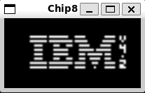

# Chip8 Emulator

A simple Chip8 emulator written in C++.



## Features
- Emulates the Chip8 instruction set
- Simple graphics rendering
- Keyboard input handling

## Building
To build the project, use the following commands:

```bash
mkdir build
cd build
cmake ..
make
```

## Running
To run the emulator, use the following command:
```bash
./chip8 <path_to_chip8_rom>
```

There is also an optional decompiler to decompile Chip8 ROMs into human-readable assembly code:
```bash
./decompiler <path_to_chip8_rom> > <output_file>
```

There are several example ROMs available in the `tests` directory which includes:
- `Rock paper scissors`: A simple rock paper scissors game by [SystemLogoff](https://johnearnest.github.io/chip8Archive/play.html?p=RPS).
- `Chip8 Test Suite`: A comprehensive test suite for Chip8 emulators by [Timendus](https://github.com/Timendus/chip8-test-suite).

You can try to download other ROMs to try from [here](https://johnearnest.github.io/chip8Archive/).

## Controls
The Chip8 keypad is mapped to the following keys on your keyboard:
```
1 2 3 C       ->  1 2 3 4
4 5 6 D       ->  Q W E R
7 8 9 E       ->  A S D F
A 0 B F       ->  Z X C V
```

## Debugger Controls
When using the built-in debugger, the following controls are available:
```
Enter = Toggle execution / Pause execution
Spacebar = Step execution (when paused)
```

## Resources used
- [Write a chip8 emulator](https://tobiasvl.github.io/blog/write-a-chip-8-emulator/)
- [Sol's Graphics Tutorial](https://solhsa.com/gp2/)


